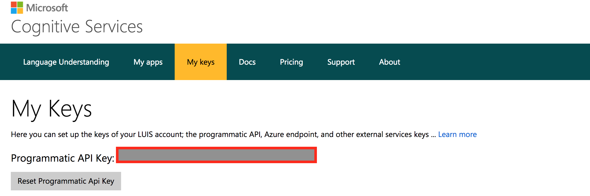
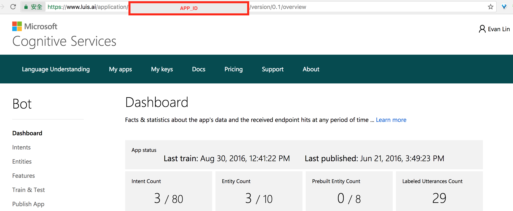

LUIS.ai for Golang
======================
[](https://raw.githubusercontent.com/kkdai/luis/master/LICENSE)  [](https://godoc.org/github.com/kkdai/luis)  [](https://travis-ci.org/kkdai/luis)
 


###Language Understanding Intelligent Service (LUIS)

LUIS lets your app understand language

- LUIS is in beta and free to use
- Supported browsers: Internet Explorer 10/11, Chrome
 
In LUIS you can:

- Create language understanding models.
- Use pre-built, world-class models from Bing and Cortana.
- Deploy your models to an HTTP endpoint.
- Activate models on any device.
 
Here is some suggestion and limitation you might want to check before add all you intent. [Chinese](https://ericyeh92094.gitbooks.io/a-simple-wechat-chatbot-generator/content/generator/%E8%87%AA%E7%84%B6%E8%AA%9E%E8%A8%80%E8%99%95%E7%90%86.html) 
 
### How to get APP_ID and APP_KEY

#### APP_KEY

Login and go to LUIS key page [https://www.luis.ai/home/keys](https://www.luis.ai/home/keys)

You can see the `API_KEY` in "My Keys".



#### APP_ID

Create a new App (if you don't have one) and in the APP dashboard, you can get `APP_ID` from web URL. It might be `12341be8-8cfb-471c-b05a-636d58cd5678`



#### Version ID (Important)

Before use this SDK, you must run follow step in luis.ai dashboard.

- Create new app
- Add few intent
- Add `Endpoint Key` (You could use your API key)
- Publish your model.

Installation
---------------

```
go get github.com/kkdai/luis
```

How to use it
---------------

```go
var API_KEY string
var APPID string

func main() {
	var API_KEY string
	var APPID string

	APPID = os.Getenv("APP_ID")
	API_KEY = os.Getenv("SUB_KEY")

	if API_KEY == "" {
		fmt.Println("Please export your key to environment first, `export SUB_KEY=12234 && export APP_ID=5678`")
	}
	if API_KEY == "" {
		return
	}

	e := NewLuis(API_KEY, APPID)

	res, err := e.IntelList()

	if err != nil {
		log.Error("Error happen on :", err.Err)
	}
	fmt.Println("Got response:", string(res))
	result := NewIntentListResponse(res)
	fmt.Println("Luis Intent Ret", result)

	//Add utterances
	ex := ExampleJson{ExampleText: "test", SelectedIntentName: "test2"}
	res, err = e.AddLabel(ex)

	//Train it
	res, err = e.Train()
	if err != nil {
		log.Error("Error happen on :", err.Err)
	}

	//Predict it, once you have train your models.
	res, err = e.Predict("test string")

	if err != nil {
		log.Error("Error happen on :", err.Err)
	}
	fmt.Println("Got response:", string(res))
	fmt.Println("Get the best predict result:", GetBestScoreIntent(NewPredictResponse(res)))
}
```

Implemented APIs
---------------

- [actionChannels](https://dev.projectoxford.ai/docs/services/56d95961e597ed0f04b76e58/operations/5739a8c71984550500affdfa)
- [intents](https://dev.projectoxford.ai/docs/services/56d95961e597ed0f04b76e58/operations/56f8a55119845511c81de467)
- [predict](https://dev.projectoxford.ai/docs/services/56d95961e597ed0f04b76e58/operations/56f8a55119845511c81de479)
- [train](https://dev.projectoxford.ai/docs/services/56d95961e597ed0f04b76e58/operations/56f8a55119845511c81de483)
- [example](https://dev.projectoxford.ai/docs/services/56d95961e597ed0f04b76e58/operations/56f8a55119845511c81de461)


Unimplement APIs (Yet)
---------------

Need your help to send your PR.

Contribute
---------------

Please open up an issue on GitHub before you put a lot efforts on pull request.
The code submitting to PR must be filtered with `gofmt`

License
---------------

This package is licensed under MIT license. See LICENSE for details.
